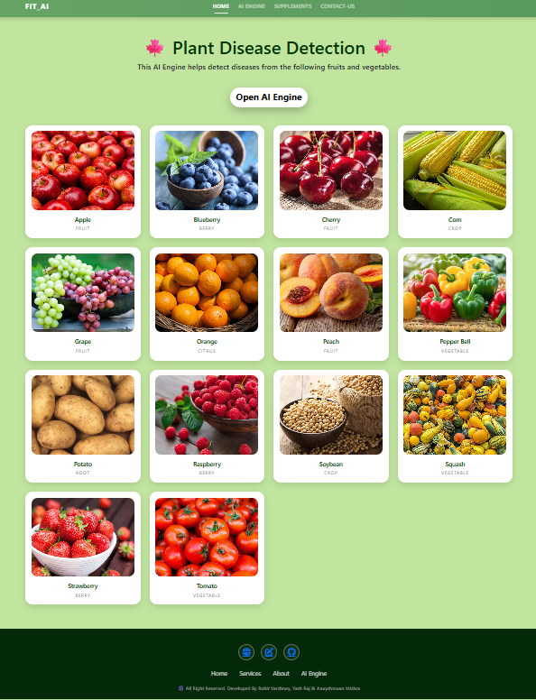
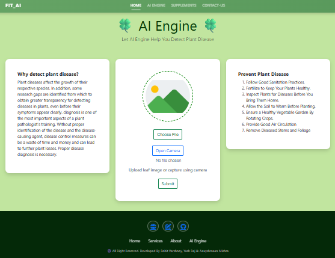
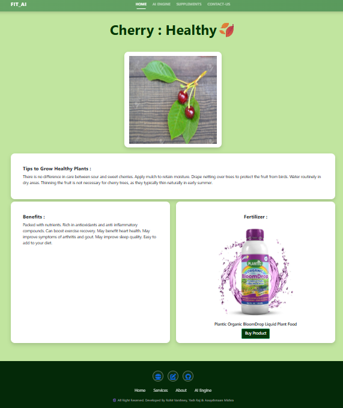
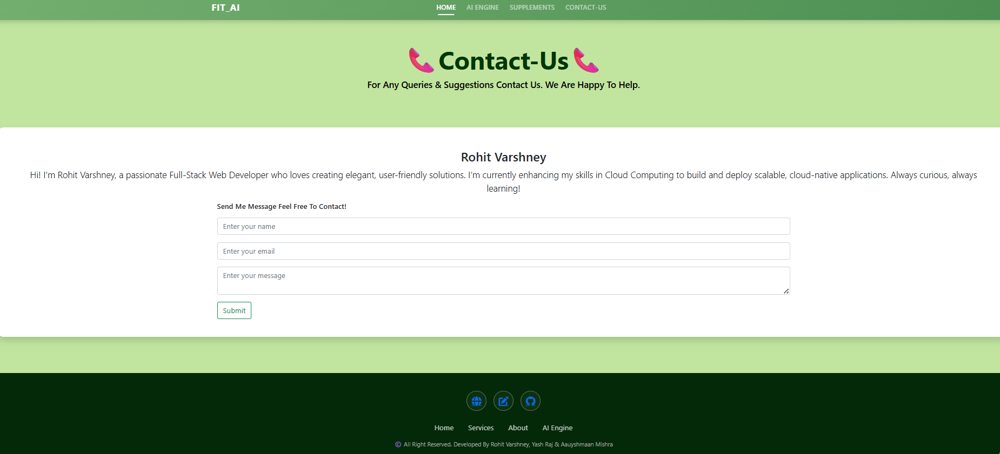

# Plant-Disease-Detection

* Plant Disease is necessary for every farmer so we are created Plant disease detection using Deep learning. In which we are using convolutional Neural Network for classifying Leaf images into 39 Different Categories. The Convolutional Neural Code build in Pytorch Framework. For Training we are using Plant village dataset. Dataset Link is in My Blog Section.

## ⭐Run Project in your Machine

* You must have **Python3.10** installed in your machine.
* Create a Python Virtual Environment & Activate Virtual Environment 
* Install all the dependencies using below command
    `pip install -r requirements.txt`
* Go to the `Flask Deployed App` folder.
* Trained model file `plant_disease_model_1.pt` train by yourself.
* Add the downloaded file in `Flask Deployed App` folder.
* Run the Flask app using below command `python app.py`
* You can also use downloaded file in `Model` Section and play with it using Jupyter Notebook.

## ⭐Installation & Setup

* Clone the repository
git clone https://github.com/your-username/your-repo-name.git

* Navigate to the project folder
cd your-repo-name

* Install dependencies
pip install -r requirements.txt

* Run the application
python app.py

## ⭐Testing Images

* If you do not have leaf images then you can use test images located in test_images folder
* Each image has its corresponding disease name, so you can verify whether the model is working perfectly or not

## ⭐Snippet of Web App :
#### Main page
  
#### AI Engine 
  
#### Results Page 
  
#### Supplements/Fertilizer  Store
  
#### Contact Us 
   

https://github.com/user-attachments/assets/9c98f2d1-af78-47df-8666-98a3ed845692

